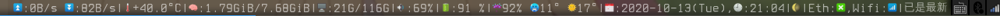

# what is dwmblock
dwmblock is this:
it can give you some information such as time,battary.with some script,even you can do like click show information,click to upgrade soft.Important,it embeded a trayer which I like the most,I don't have to set a external trayer anymore.the color font can be fond **ttf-joypixels**.

dwmblock is also writeen in c,but it perhaps not writeen by suckless.org.So the only thing I think I use it is it can gave me a color status bar,and a trayer.

So I don't give it an external repo.

## these perhaps you need to install:

- ttf-joypixels
- notify-send
- pkill
- picom
- sensors
- pamixer

and you might want to change config.h's absolute path.

## You must compile it.

Because it is a C progame.
So,you will need to sudo make clean install on dwmblock directory.
